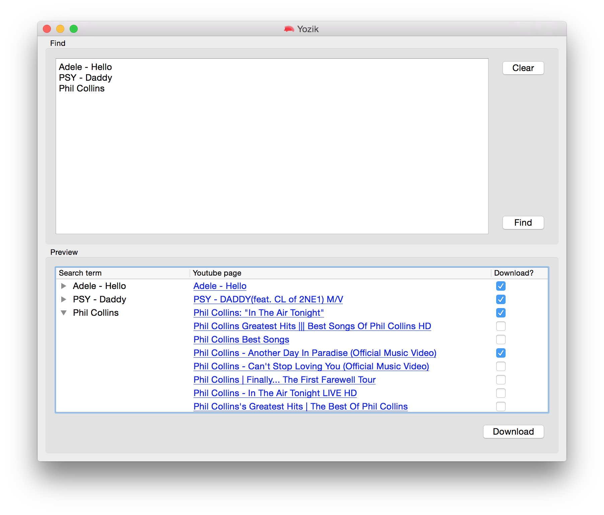
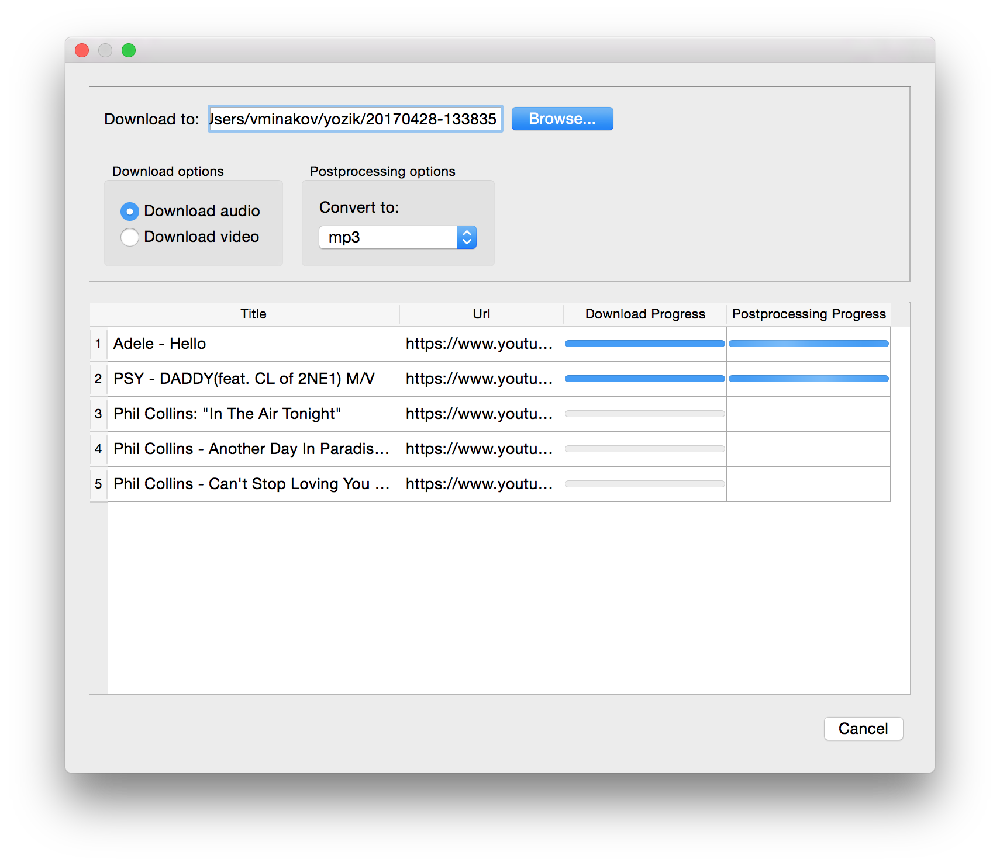

# Yozik - The Youtube Ripper

**Simple cross-platform GUI for the wonderful [youtube-dl](https://github.com/rg3/youtube-dl) programm**

## Screenshots

## Features

* Download audio tracks and video files from Youtube
* Integration with ffmpeg or libav to convert downloaded files to MP3, OGG, MP4, WEBM, etc.
* Easy to use UI
* Integrated search with video previews
* Support for parallel downloads and conversions
* Works on Linux, Mac OS X and Windows

## Installation
Until packages are provided you need to install following dependencies:
* Python >= 3.2
* PyQt >= 5.3
* youtube-dl
* ffmpeg or libav

To run the app simply execute "./run.py"

### Mac OS X
To install quickly on Mac OS X install dependecies

    $> brew install ffmpeg python3
    $> pip3 install PyQt5 youtube-dl

And then clone the repository and execute "./run.py"

### Linux
To install on Debian based distros (tested on Debian 8 and Linux Mint 18) install dependecies:

    $> sudo apt-get install python3-pip python3-pyqt5 python3-pyqt5.qtwebkit
    $> sudo pip3 install youtube-dl

And then clone the repository and execute "./run.py"

### Windows
TBD

### Vagrant
Alternatively, you can test or run the app in Vagrant environment. Ensure you have latest Vagrant and VirtualBox installed and just run from root folder:

    vagrant up

It will install a Debian box with all necessary dependencies.

## Roadmap
* General: Provide packages and installers for various Linux distributions, Mac OS X and Windows
* General: Clean up the code, make it PEP8 compliant where it is possible
* General: handle errors gracefully (i.e. wrong download path, converting errors)
* Search section: make it possible to check/uncheck and preview videos with keyboard shortcuts
* Search section: display processed search terms in the tree view as soon as they become available
* Search section: use status bar to show progress of the search (no of processed, remaining, etc.)
* Search section: show available quality information
* ~~Search section: handle youtube-dl playlists and direct links properly (WIP)~~
* Search section: clean up search code, agree on naming conventions
* Search section: check for download all videos in playlists by default
* ~~Search section: replace custom html5lib based search with youtube-dl~~
* ~~Search section: cache search results for same search terms~~
* Download section: show elapsed time, ETA
* Download section: advanced youtube-dl and ffmpeg options (select quality, resolutions, codecs, etc.)
* Download section: hits and tips for video formats (which are better suitable for phones/tablets/desktops/etc.)
* Download section: open destination folder button
* UI: do some icons, make it more dynamic
* UI: draw a better logo
* UI: fix static sizes, adapt UI to different themes
* New: integrate with mp3gain to normalize sound in downloaded files
* New: download static ffmpeg binaries if it's not installed
* New: provide a way to upgrade youtube-dl automatically
* New: preferences menu - configure default download paths, naming conventions, proxy settings, login credentials, etc.

## License

The MIT License (MIT). Please see [License File](LICENSE.txt) for more information.
